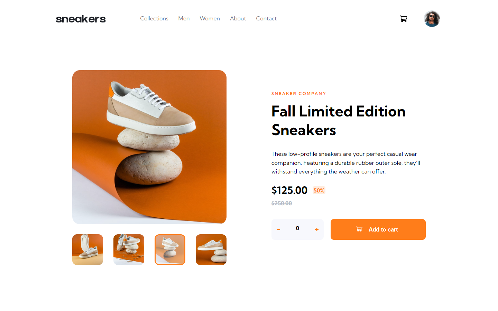

# Frontend Mentor - ecommerce product page

This is my solution to the [Ecommerce product page challenge](https://www.frontendmentor.io/challenges/rock-paper-scissors-game-pTgwgvgH/) on Frontend Mentor. Frontend Mentor challenges help you improve your coding skills by building realistic projects. 

## Table of contents

- [Overview](#overview)
  - [The challenge](#the-challenge)
  - [Screenshot](#screenshot)
  - [Links](#links)
- [My process](#my-process)
  - [Built with](#built-with)
  - [What I learned](#what-i-learned)
- [Author](#author)

### Screenshot

### Links
- Live Site URL: [Live Site](https://dundeea.github.io/ecommerce-product-page/)

## My process
I started this project by drawing a small wireframe over the original design with the different html5 elements I wanted to include for the sake of semantic mark up. I continued development by breaking the project into several small task that eventually lead to the finished product. 

### Built with

- Semantic HTML5 markup
- SASS
- Flexbox
- Jquery
- Mobile first design

### What I learned
I took this challenge on as an opportunity to learn SASS, I also decided to get more practice with Jquery, I definitely got some good practice in with both.
## Author
- Github - [@DundeeA](https://github.com/DundeeA)
- Frontend Mentor - [@DundeeA](https://www.frontendmentor.io/profile/DundeeA)
